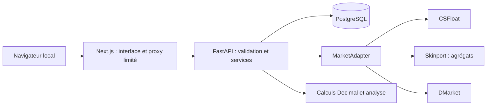

# Architecture

## Choix

Le dépôt initial était vide (voir [AUDIT.md](AUDIT.md)). Nous conservons
l'architecture demandée : un monolithe modulaire, composé d'une API Python
FastAPI, d'une base PostgreSQL et d'une interface Next.js / TypeScript.
Docker Compose orchestre ces trois processus localement. Aucun Redis,
Kubernetes, service de messages ou infrastructure cloud n'est requis.

## Frontières

- `apps/web` : affichage, filtres, états de chargement et navigation. Les
  secrets des marketplaces ne transitent jamais par le navigateur.
- `apps/api/app/markets` : JSON propriétaire, authentification, limitations
  et erreurs externes. Chaque adaptateur produit des DTO normalisés.
- `apps/api/app` : modèles SQL, services de collecte, comparaison et calculs,
  schémas HTTP validés et gestion de configuration.
- `apps/api/alembic` : évolution explicite du schéma. L'application n'effectue
  pas de `create_all` silencieux en production.
- `apps/api/tests` : calculs financiers, erreurs d'API, normalisation et
  comportement des services. Les fixtures sont des données synthétiques.

Les prix restent des `Decimal` côté Python et des décimaux SQL. L'API
sérialise les montants en chaînes ; JavaScript les convertit uniquement
pour affichage et tri, sans devenir le moteur financier.

## Collecte et provenance

Le mode réel est le mode initial. Une synchronisation est demandée
explicitement pour un nom de marché. Les réponses sont mises en cache avec
TTL et les tentatives sont bornées. Une indisponibilité d'un fournisseur
ne doit pas effacer ses dernières données connues ni empêcher l'affichage
des autres fournisseurs. L'âge et les erreurs restent visibles.

La démo exige une action explicite et possède une provenance distincte
dans le stockage. Il n'existe aucun repli automatique du réel vers la démo.
Les agrégats Skinport ne deviennent jamais des listings identifiant un skin
individuel. Les types LISTING, SALE, BUY_ORDER, TRADE_VALUE et AGGREGATE
restent distincts dans le modèle conceptuel.

Les endpoints sont en lecture/analyse : la synchronisation écrit des
observations dans notre base mais n'achète rien sur les marketplaces.

## Sécurité et exploitation locale

Les ports publiés par Compose écoutent sur `127.0.0.1`. PostgreSQL reste
sur le réseau interne Compose. L'application n'a pas encore de connexion
utilisateur et ne doit pas être publiée sur Internet dans cet état.
Le proxy Next.js utilise une destination configurée côté serveur, avec
une liste limitée de routes, des délais bornés et aucune destination
fournie librement par le navigateur. CORS est limité à l'origine locale.

Les secrets proviennent de l'environnement ; `.env` est ignoré par Git et
exclu des images Docker. Les erreurs client ne contiennent pas de trace
interne. Les logs de fournisseur contiennent le marché, la route, le statut,
la durée et un code d'erreur ; ils ne contiennent pas les en-têtes d'auth.

Un seul processus API est prévu au départ : le cache et le contrôle de
concurrence sont locaux au processus. Avant plusieurs workers, déplacer
le contrôle des quotas et la planification dans une coordination partagée.

## Extensions futures

Le Trade Engine utilisera un autre contrat d'adaptation : `TradeQuote`
décrira les objets donnés/reçus, les crédits proposés par la plateforme,
les valeurs cash estimées séparées, les frais et l'expiration. Les
plateformes Tradeit, CS.MONEY, Swap.gg et SkinsMonkey sont à étudier
(`RESEARCH_REQUIRED`), sans supposer l'existence d'une API publique.

Le Currency Engine conservera un `FxQuote` avec montant/devise originaux,
taux, source, date et nature référence/effectif. EUR est la référence ;
USD, GBP, JPY, CHF et CNY seront ajoutées avec un fournisseur documenté.

Le Route Optimizer pourra consommer les mêmes objets normalisés. Chaque
arête (achat, vente, conversion, trade) portera coût, frais, taux effectif,
risque, liquidité, délai et restrictions. Aucun graphe d'optimisation ni
algorithme de recherche de routes n'est implémenté maintenant.

Portfolio et watchlist ajouteront leurs propres services autour de
`Purchase` et `WatchRule`, sans incorporer les formats propriétaires
des marketplaces dans leur logique métier.
